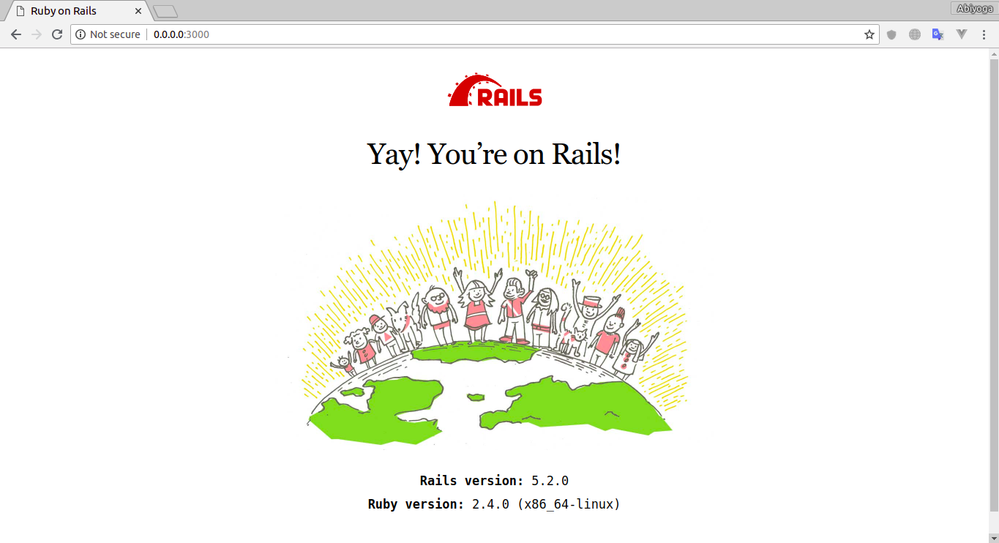
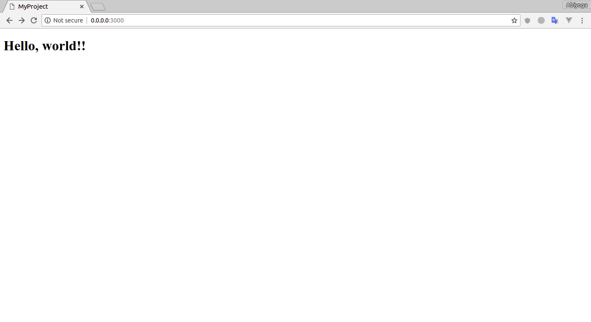

# Ruby On Rails

## Getting Started with Rails

### First rails app

So the Rails is installed but how do we get start with Rails?. Well just run `rails new my-project` at the terminal and Rails will generate the application files and folders for us. And don't forget you can named the application whatever you want like `rails new blog` but in this case we gonna name it "my-project".
```
$ rails new my-project
```
After that your app will created. Let's move to your app directory and look what Rails have done.
```
$ cd my-project
$ ls -l
drwxrwxr-x 10 root root 4096 Agu  4 13:21 app
drwxr-xr-x  2 root root 4096 Agu  4 13:21 bin
drwxrwxr-x  5 root root 4096 Agu  4 13:21 config
-rw-rw-r--  1 root root  130 Agu  4 13:21 config.ru
drwxrwxr-x  2 root root 4096 Agu  4 13:21 db
-rw-rw-r--  1 root root 2205 Agu  4 13:21 Gemfile
-rw-rw-r--  1 root root 5293 Agu  4 13:21 Gemfile.lock
drwxrwxr-x  4 root root 4096 Agu  4 13:21 lib
drwxrwxr-x  2 root root 4096 Agu  4 13:42 log
-rw-rw-r--  1 root root   68 Agu  4 13:21 package.json
drwxrwxr-x  2 root root 4096 Agu  4 13:21 public
-rw-rw-r--  1 root root  227 Agu  4 13:21 Rakefile
-rw-rw-r--  1 root root  374 Agu  4 13:21 README.md
drwxrwxr-x  2 root root 4096 Agu  4 13:21 storage
drwxrwxr-x  9 root root 4096 Agu  4 13:21 test
drwxrwxr-x  6 root root 4096 Agu  4 13:42 tmp
drwxrwxr-x  2 root root 4096 Agu  4 13:21 vendor
``` 
### Rails working directory

Let's take a look what the purpose of files and folders was created by Rails.

| File/Folder   | Purpose       |
| ------------  | ------------- |
| App/          | Contains the controllers, models, views, helpers, mailers, channels, jobs and assets for your application. You'll focus on this folder for the remainder of this guide. |
| bin/          | Contains the rails script that starts your app and can contain other scripts you use to setup, update, deploy or run your application.  |
| config/       | Configure your application's routes, database, and more.  |
| config.ru     | Rack configuration for Rack based servers used to start the application.  |
| db/           | Contains your current database schema, as well as the database migrations.  |
| Gemfile and Gemfile.lock | These files allow you to specify what gem dependencies are needed for your Rails application. These files are used by the Bundler gem.  |
| lib/          | Extended modules for your application.  |
| log/          | Application log files.  |
| package.json  | This file allows you to specify what npm dependencies are needed for your Rails application. This file is used by Yarn.  |
| public/       | The only folder seen by the world as-is. Contains static files and compiled assets.  |
| Rakefile      | This file locates and loads tasks that can be run from the command line. The task definitions are defined throughout the components of Rails. Rather than changing Rakefile, you should add your own tasks by adding files to the lib/tasks directory of your application.  |
| README.md     | This is a brief instruction manual for your application. You should edit this file to tell others what your application does, how to set it up, and so on.  |
| test/         | Unit tests, fixtures, and other test apparatus.  |
| tmp/          | Temporary files (like cache and pid files).  |
| vendor/       | A place for all third-party code. In a typical Rails application this includes vendored gems.  |
| .gitignore    | This file tells git which files (or patterns) it should ignore.  |
| .ruby-version | This file contains the default Ruby version.  |

For now let's keep moving on by doing a basic "Hello world" in Rails.

### Work around in Rails
As you can see we list the file and folder in working directory with `ls -l` command. Let's try to running the application with `rails server` command.
```
$ rails server
=> Booting Puma
=> Rails 5.2.0 application starting in development 
=> Run `rails server -h` for more startup options
Puma starting in single mode...
* Version 3.12.0 (ruby 2.4.0-p0), codename: Llamas in Pajamas
* Min threads: 5, max threads: 5
* Environment: development
* Listening on tcp://0.0.0.0:3000
Use Ctrl-C to stop
```
Open your browser and navigate to `http://0.0.0.0:3000`. You should see the Rails default page.



Now your web app is ready. But Rails is running with single static page and a default image. Let's do a basic "hello world" in Rails app.

#### "Hello World" on Rails

To say "Hello world" with Rails you need to create at least a _controller_ and a _view_.

A controller's purpose is to receive specific requests for the application. _Routing_ decides which controller receives which requests. And you can say a controller's is the place where application logic and algorithm is working. Often, there is more than one route to each controller, and different routes can be served by different _actions_. Each action's purpose is to collect information to provide it to a view.

A view as you read is to display the information in a human readable format. The view should just display the information that come from controller. By default, view templates are written in eRuby (Embedded Ruby) which is processed by the request cycle in Rails before being sent to the user.

To create a new controller, you will need to run the "controller" generator and tell it you want a controller called "welcome" with an action called "index".

```
bin/rails generate controller welcome index
```

And Rails will create several files and a route for you.
```
create  app/controllers/welcome_controller.rb
 route  get 'welcome/index'
invoke  erb
create    app/views/welcome
create    app/views/welcome/index.html.erb
invoke  test_unit
create    test/controllers/welcome_controller_test.rb
invoke  helper
create    app/helpers/welcome_helper.rb
invoke    test_unit
invoke  assets
invoke    coffee
create      app/assets/javascripts/welcome.coffee
invoke    scss
create      app/assets/stylesheets/welcome.scss
```

The controller is located at `app/controllers/welcome_controller.rb` and the view is located at `app/views/welcome/index.html.erb`.

Open the `app/views/welcome/index.html.erb` file in your text editor. Delete all of the existing code and replace it with single line of "hello world" code.
```html
<h1>Hello, world!!</h1>
```

#### Setting the application home page

Now that we made the controller and view. Next we need to tell Rails when we want "Hello world", to show up. In this case, we want it to show up when we navigate to the root URL of our site, `http://0.0.0.0:3000`. To do that, open the file `config/routes.rb` in your editor.
```ruby
Rails.application.routes.draw do
  get 'welcome/index'
  # For details on the DSL available within this file, see http://guides.rubyonrails.org/routing.html
end
```

This is your application's _routing_ files. The routes file is hold entries in a special DSL [domain-specific language](https://en.wikipedia.org/wiki/Domain-specific_language) that tells Rails how to connect incoming requests to controllers and actions. Now edit this file as below.
```ruby
Rails.application.routes.draw do
  get 'welcome/index'

  root 'welcome#index'
end
```

`root 'welcome#index'` tells Rails to map requests to the root of the application to the welcome controller's index action and `get 'welcome/index'` tells Rails to map requests to `http://0.0.0.0:3000/welcome/index` to the welcome controller's index action. This was created earlier when you ran the controller generator.

Now refresh the page and you'll see the "hello world!!" message you put into `app/views/welcome/index.html.erb`.

