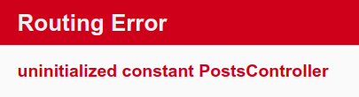
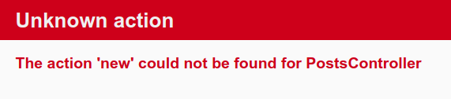
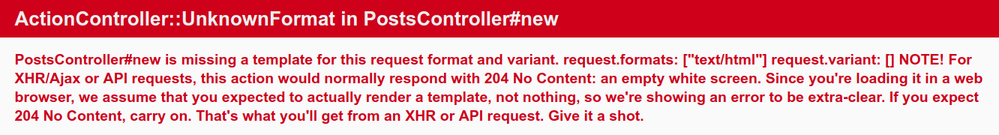
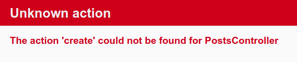
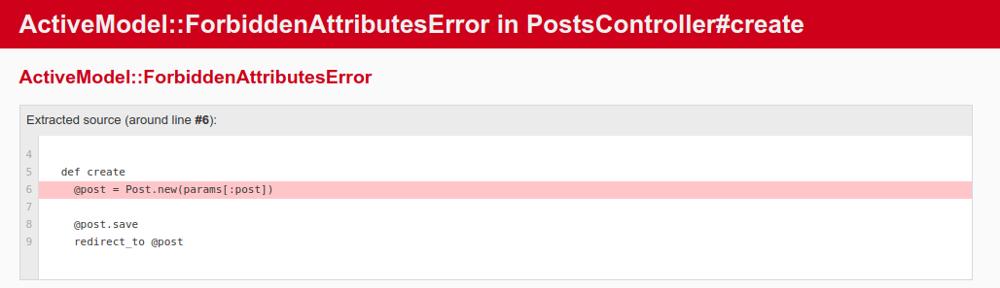
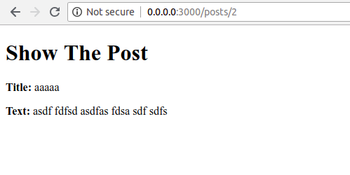
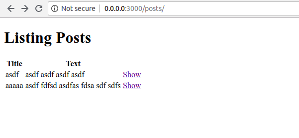
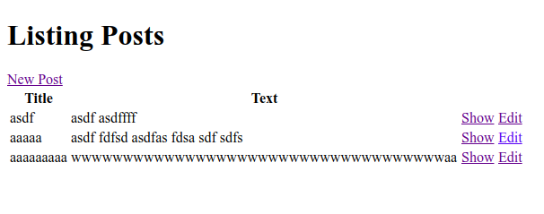

## Rails Resources

In your application, you will create a new _resource_ for doing the operational of CRUD (Create, Read, Update, and Delete). A resource is the term used for a collection of similiar objects such as articles, people or animals.

Rails provides a _resources_ method which can be used to declare a standard [REST](https://en.wikipedia.org/wiki/Representational_state_transfer) resource. Now you need to add the _posts resource_ to the `config/routes.rb` as below:
```ruby
Rails.application.routes.draw do
  get 'welcome/index'

  resources :posts

  root 'welcome#index'
  # For details on the DSL available within this file, see http://guides.rubyonrails.org/routing.html
end

```
If you run `bin/rails routes`, you'll see that it has defined routes for all the standard RESTful actions.
```
$ bin/rails routes
                   Prefix Verb   URI Pattern                                                                              Controller#Action
            welcome_index GET    /welcome/index(.:format)                                                                 welcome#index
                    posts GET    /posts(.:format)                                                                         posts#index
                          POST   /posts(.:format)                                                                         posts#create
                 new_post GET    /posts/new(.:format)                                                                     posts#new
                edit_post GET    /posts/:id/edit(.:format)                                                                posts#edit
                     post GET    /posts/:id(.:format)                                                                     posts#show
                          PATCH  /posts/:id(.:format)                                                                     posts#update
                          PUT    /posts/:id(.:format)                                                                     posts#update
                          DELETE /posts/:id(.:format)                                                                     posts#destroy
                     root GET    /                                                                                        welcome#index
       rails_service_blob GET    /rails/active_storage/blobs/:signed_id/*filename(.:format)                               active_storage/blobs#show
rails_blob_representation GET    /rails/active_storage/representations/:signed_blob_id/:variation_key/*filename(.:format) active_storage/representations#show
       rails_disk_service GET    /rails/active_storage/disk/:encoded_key/*filename(.:format)                              active_storage/disk#show
update_rails_disk_service PUT    /rails/active_storage/disk/:encoded_token(.:format)                                      active_storage/disk#update
     rails_direct_uploads POST   /rails/active_storage/direct_uploads(.:format)                                           active_storage/direct_uploads#create
```
Next you will add the ability to create new posts in your application and be able to view them.

### New Post
As you can see in the rails `bin/rails routes` log, you can access `http://0.0.0.0:3000/posts/new` directly on browser. Go ahead and check that. Then you will get the error like this.



The error occurs because the route need to have a controller defined in order to serve the request. Let's generate new controller called `PostsController` to solve the error.

#### Create the PostController
To generate the controller, simply do a command as below.
```
$ bin/rails genereate controller Posts
```

Now open the Posts controller at `app/controllers/posts_controller.rb`, you'll see a empty controller.

```ruby
class PostsController < ApplicationController
end
```
The controller is created. Go refresh the `http://0.0.0.0:3000/posts/new` URL and you will get the error again.



This error indicates that Rails cannot find the "new" action. What is "new" action mean?. In Rails you just generate a controller that named `PostsController`. And Ruby is [_Object Oriented Programming_](https://en.wikipedia.org/wiki/Object-oriented_programming) Which mean you'll code with OOP concept like class, method, and many "Object Oriented" concept. And the error that you saw before mean Rails cannot find the 'new' action or you can say 'method' in the `PostsController` class.

#### Define new method

For the first try, let's create a new method called 'new' inside the `posts_controller.rb` class.
```ruby
class PostsController < ApplicationController
  def new
  end
end
```
Refresh the page and you'll get the error again.



You're get alot of error. Let's go through and understand what each part of it means.

The first part identifies which templates is missing. In this case, it's the `posts/new` templates. Rails will first look for this template. If not found, then it will attempt to load a template called `application/new` because the `PostsController` is inherites from `ApplicationController`.

The next part of the message contains request.formats which specifies the format of template to be served in response. It is set to `text/html` as we requested this page via browser, so Rails is looking for an HTML template.

#### Create new form
Let's create a file `new.html.erb` views for `PostsController` at `app/views/posts`, And write this content in it.
```erb
<h1>New Posts</h1>

<%= form_with scope: :article, local: true do |form| %>
  <p>
    <%= form.label :title %><br>
    <%= form.text_field :title %>
  </p>
 
  <p>
    <%= form.label :text %><br>
    <%= form.text_area :text %>
  </p>
 
  <p>
    <%= form.submit %>
  </p>
<% end %>
```

As you can see, you will use a _form builder_. The primary form builder for Rails is provided by a helper method `form_with`. If you refresh the page now, you'll see the form is displaying sucessfuly. There's the one problem with this form though. If you inspect the HTML that is generated, by viewing the source of the page, you will see that the `action` attribute for the form is pointing at `/posts/new`. This is a problem because this routes goes to the very page that you're on right at the moment, and that route should only be used to display the form for a new post.

The form needs to use different URL in order to go somewhere else. This can be done with `:url` option of `form_with`. Edit the `form_with` line inside `app/views/posts/new.html.erb`.

```
<%= form_with scope: :article, url: posts_path, local: true do |form| %>
```

In this example, the `posts_path` helper is passed to the `:url` option. In this case, helper tells the Rails to point the form to the URI Pattern associated with the `posts` prefix. And the form will (by default) send a `POST` request to that routes. You can check the URL Pattern by running this command.
```
$ bin/rails routes
```
It will generated a list of the URI that same as [above](#rails-resources).

After that go fill up the form and submit that. You'll get this error.



The error is very meaningful as before. That mean Rails can't find `create` method at your `posts_controller.rb`.

#### Define create method
Same as before. Let's create a new method called `create` inside the `PostsController` class.
```ruby
class PostsController < ApplicationController

  def create
    render plain: params[:post].inspect
  end

end

```
The `render` method here is taking a very simple hash with a key of `:plain` and value of `params[:posts]`.inspect. The params method is the object which represents the parameters (or fields) coming in from the form. The params method returns an `ActionController::Parameters` object, which allows you to access the keys of the hash using either strings or symbols. In this situation, the only parameters that matter are the ones from the form.

If you submit the form, you'll see something like this
```
<ActionController::Parameters {"title"=>"asdf", "text"=>"asdfasd asdf asdf asdfafsdf"} permitted: false>
```
This action is now displaying the parameters for the article that are coming in from the form. But this is not really all that helpful.

#### Model for post

When you create a `create` action, this mean you create the data and store it to database. But this will never get done if you never created the Database, right?. So how to create the DB?. The good news is, Rails come with sqlite3 as the default DB. Simply run this command at your terminal and Rails will do the rest for us.
```
$ bin/rails generate model Post title:string text:text
```
What that command mean is we told Rails `Post` model, together with _title_ attribute of type string, and a _text_ attribute of type text.

So far we talk about `model`, `view`, and `controller`. And that's make sense, it because Ruby On Rails is working with architectural pattern commonly known as [MVC](https://en.wikipedia.org/wiki/Model%E2%80%93view%E2%80%93controller) Which is `model` is represents the data structure. It is the application's dynamic data structure, independent of the user interface. It directly manages the data, logic and rules of the application.

Rails responded by creating a bunch of files. For now, we are only take a look in `app/models/post.rb` and `db/migrate/20180806092757_create_posts.rb`

#### Run the migration

Before run the migration, let's take a look at `db/migrate/20180806092757_create_posts.rb`
```ruby
class CreatePosts < ActiveRecord::Migration[5.2]
  def change
    create_table :posts do |t|
      t.string :title
      t.text :text

      t.timestamps
    end
  end
end

```

The above migration creates as a method named `change` which will be called when you run this migration. It will create table named `posts` with one string `title` column and a `text` column after you run the migration.

Now run the migration command just like this.
```
$ bin/rails db:migrate
```

Rails will execute this migration command and tell you it created the Posts table.
```
== 20180806092757 CreatePosts: migrating ======================================
-- create_table(:posts)                                                        
   -> 0.0031s                                                                  
== 20180806092757 CreatePosts: migrated (0.0032s) =============================
```

#### Saving data in the controller

Now the model is migrated. Let's edit the `posts_controller.rb`. We need to edit `create` method as below.
```ruby
class PostsController < ApplicationController

  def create
    @post = Post.new(params[:post])

    @post.save
    redirect_to @post
  end

end
```

Here's what's going on: In the first line we add the data in `Post` table with `.new()` function using the parameter from request that carry on with `params[:post]`. `@post` it's a instance variable and is available to all methods within the class. Then `@post.save` is responsible for saving the model in the database and after that we redirect the user to `show` action.

Now let's try to add the new post by access `http://0.0.0.0:3000/posts/new` and fill up the form. Go submit the form and you will get error like this.



#### Secure the paramters

Rails has several security features that help you write secure applications, and you're running into one of them now. This one is called strong parameters, which requires us to tell Rails exactly which parameters are allowed into our controller actions. If don't secure the paramters that come from submit request, It very dangerous because it might be contain extra filed with values that violated your application's integrity. They would be 'mass assigned' into your model and then into the database along with the good stuff - potentially breaking your application.

We have to whitelist our controller parameters to prevent wrongful mass assigment. In this case, we want to both allow and require the `title` and `text` parameters for vaild of `create`.
```ruby
class PostsController < ApplicationController

  def create
    @post = Post.new(post_params)

    @post.save
    redirect_to @post
  end

  private
    def post_params
      params.require(:post).permit(:title,:text)
    end

end
```
This is often factored out into its own method so it can be reused by multiple actions in the same controller, for example `create` and `update`. The method is often made `private` to make sure it can't be called outside its intended context.

### Show Post
If you try to submit the form, Rails will complain about not finding `show` action. And if you take a look the URL, it looks like `http://0.0.0.0:3000/posts/1` which mean after you submit the form it will navigate to `/posts/:id/` URI. 

#### Define show method

Same as [new post](#new-post) (but without model and migration), you need to create correspondent method and view to display the information. Let's create the `show` method first.
```ruby
  def show
    @post = Post.find(params[:id])
  end
```
Things to note. We use `Post.find` to find the article we're interested in, passing in `params[:id]` to get the `:id` parameter from the request. Then we'll use instance variable (prefixed with `@`) to hold a reference to post object and pass the instance to the view.

#### Create show file
Now, create file named `show.html.erb` in `app/views/posts/` with the following content
```
<h1>Show The Post</h1>
<p>
  <strong>Title:</strong>
  <%= @post.title %>
</p>
 
<p>
  <strong>Text:</strong>
  <%= @post.text %>
</p>
```
And after you submit the form, You'll see the post has been sucessfuly to display.



### List All Post

So far we just created `new` and `show`. But how does we see all these data in one page?. We need to list all our posts, so let's do that by creating `index` method in `posts_controller.rb`.
```ruby
class PostsController < ApplicationController

  def index
    @post = Post.all
  end

  #above 'new' method
end
```

And create new file named `index` at `app/views/posts/index.html.erb`.
```
<h1>Listing Posts</h1>
 
<table>
  <tr>
    <th>Title</th>
    <th>Text</th>
    <th></th>
  </tr>
 
  <% @post.each do |posts| %>
    <tr>
      <td><%= posts.title %></td>
      <td><%= posts.text %></td>
      <td><%= link_to 'Show', post_path(posts) %></td>
    </tr>
  <% end %>
</table>
```
Then navigate browser to `http://0.0.0.0:3000/posts` You'll see all the post are listed in table with the link to show the post.



#### Add link
But we missed a simple thing. We need to add a link to `/posts` view in the root of page. So when user navigate to `http://0.0.0.0:3000`, It will contain a link to `/posts`.

Open `app/views/welcome/index.html.erb` and add the link.
```
<h1>Hello, world!!</h1>
<%= link_to 'My Post', controller: 'posts' %>
```
The `link_to` method is one of Rails built-in view helpers. It create hyperlink based on text to display and where to go.

Next add another link called "New Post" in `app/viewws/posts/index.html.erb` placing it above the `<table>` tag.
```
<%= link_to 'New Post', new_post_path %>
```
Now give a link to back to `/posts` URL in `app/views/posts/new.html.erb` in the bottom of the code.
```
<h1>new Post</h1>

<%= form_with scope: :post, url: posts_path, local: true do |f|%>
<p>
  <%= f.label :title %><br>
  <%= f.text_field :title %>
</p>

<p>
  <%= f.label :text %><br>
  <%= f.text_area :text %>
</p>

<p>
  <%= f.submit %>
</p>
<% end %>

<%= link_to 'Back', posts_path %>
```
And finally add another link to go back to posts index in `app/views/posts/show.html.erb`.
```
<h1>Show The Post</h1>
<p>
  <strong>Title:</strong>
  <%= @post.title %>
</p>
 
<p>
  <strong>Text:</strong>
  <%= @post.text %>
</p>

<%= link_to 'Back', posts_path %>
```

### Update a Post

Great. We've covered "CR" in the CRUD. Now let's focus on "U" part.

#### Define edit method
The first step is of course to add new method called `edit` in `PostsController`. We named it `edit` as the action that covered the URI pattern. Let's show the routes list again for reminder.
```
$ bin/rails routes
                   Prefix Verb   URI Pattern                                                                              Controller#Action
            welcome_index GET    /welcome/index(.:format)                                                                 welcome#index
                    posts GET    /posts(.:format)                                                                         posts#index
                          POST   /posts(.:format)                                                                         posts#create
                 new_post GET    /posts/new(.:format)                                                                     posts#new
                edit_post GET    /posts/:id/edit(.:format)                                                                posts#edit
                     post GET    /posts/:id(.:format)                                                                     posts#show
                          PATCH  /posts/:id(.:format)                                                                     posts#update
                          PUT    /posts/:id(.:format)                                                                     posts#update
                          DELETE /posts/:id(.:format)                                                                     posts#destroy
                     root GET    /                                                                                        welcome#index
       rails_service_blob GET    /rails/active_storage/blobs/:signed_id/*filename(.:format)                               active_storage/blobs#show
rails_blob_representation GET    /rails/active_storage/representations/:signed_blob_id/:variation_key/*filename(.:format) active_storage/representations#show
       rails_disk_service GET    /rails/active_storage/disk/:encoded_key/*filename(.:format)                              active_storage/disk#show
update_rails_disk_service PUT    /rails/active_storage/disk/:encoded_token(.:format)                                      active_storage/disk#update
     rails_direct_uploads POST   /rails/active_storage/direct_uploads(.:format)                                           active_storage/direct_uploads#create
```

You can see at `Controller#Action` column it must be `edit`. Let's create the action now.

```ruby
class PostsController < ApplicationController
  def edit
    @posts = Post.find(params[:id])
  end
end
```

#### Create edit file

And create new file named `edit.html.erb` in `app/views/posts/` and make it look as follows:
```
<h1>Edit Post</h1>
 
<%= form_with(model: @post, local: true) do |form| %>

  <p>
    <%= form.label :title %><br>
    <%= form.text_field :title %>
  </p>
 
  <p>
    <%= form.label :text %><br>
    <%= form.text_area :text %>
  </p>
 
  <p>
    <%= form.submit %>
  </p>
 
<% end %>
 
<%= link_to 'Back', articles_path %>
```

The view contain a form similiar to the one we used to create new post. This time we point the form to the `update` action, which is not defined yet but will be very soon.

Passing the article object to the method, will automagically create url for submitting the edited post form. This option tells Rails that we want this form to be submitted via the PATCH HTTP method which is the HTTP method you're expected to use to update resources according to the REST protocol.

The arguments to `form_with` could be model objects, say, `model: @article` which would cause the helper to fill in the form with the fields of the object. Passing in a symbol `scope` (`scope: :article`) just creates the fields but without anything filled into them.

And don't forget to add the `update` link in `show` and `index` page.
```
<h1>Show The Post</h1>
<p>
  <strong>Title:</strong>
  <%= @post.title %>
</p>
 
<p>
  <strong>Text:</strong>
  <%= @post.text %>
</p>

<%= link_to 'Edit', edit_post_path(@post) %> |
<%= link_to 'Back', posts_path %>
```
for `index` you can add link after `show` link insert `<td>` tag.
```
<td><%= link_to 'Edit', edit_post_path(posts) %></td>
```

#### Define update method

After that you must create `update` method.
```ruby
  def update
    @post = Post.find(params[:id])

    if @post.update(post_params)
      redirect_to @post
    else
      render 'edit'
    end
  end
```

The new method `update`, is used when you want to update a record that already exists and it accepts a hash containing the attributes that you want to update. As before, if there was an error updating the article we want to show the form back to user. If you noticed that, we reuse `post_params` method that we defined earlier for create action.

After that you'll look your app like this.


### Delete Post

So far we just created "C", "R", and "U". The last is the "D" AKA Delete. Why we need to delete the post that already created?. Because CRUD is a basic practical method for web development. And the data sometime is growing much bigger than before so we need to delete some data that no longer used.

#### Define delete and add action

Following the REST convention, the route for deleting posts as per output of `bin/rails routes` is
```
DELETE /posts/:id(.:format) posts#destroy
```

the `delete` routing method should be used for routes that destroy the resources. We use the `delete` method for destroying resources, and this route is mapped to the `destroy` action inside `app/controllers/posts_controller.rb`. Let's create it now at the top of private method.
```ruby
  def destroy
    @post = Post.find(params[:id])
    @post.destroy

    redirect_to @post
  end
```

Now call `destroy` on Active Record objects when you want to delete them from the database. We dont need to add a view for this action since we're redirecting to the `index` action.

Add 'Destroy' link to your `index` template. Add it wrapped wtith `<td>` tag and below the `edit` link.
```
<h1>Listing Posts</h1>

<%= link_to 'New Post', new_post_path %>
 
<table>
  <tr>
    <th>Title</th>
    <th>Text</th>
    <th></th>
  </tr>
 
  <% @post.each do |posts| %>
    <tr>
      <td><%= posts.title %></td>
      <td><%= posts.text %></td>
      <td><%= link_to 'Show', post_path(posts) %></td>
      <td><%= link_to 'Edit', edit_post_path(posts) %></td>
      <td><%= link_to 'Destroy', post_path(posts),
              method: :delete,
              data: { confirm: 'Are you sure?' } %></td>
    </tr>
  <% end %>
</table>
```

The `delete` link is little bit different. The `method: :delete` and `data: { confirm: 'Are you sure?' }` options are used as HTML5 attributes so, when the link is clicked, Rails will first show the confirm message to the user, and then submit the link with method `delete`.

Good work. You finised the CRUD operation in this section.