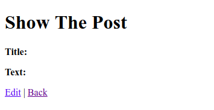
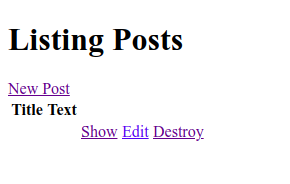
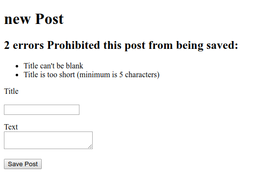

## Adding The Validation

If you look at "Create" at CRUD section, the operation seems to run normally. But you missed something that very important. You'll know that if you submit the form without fill it. And your post will look like this.



And also your list Posts will look like this.



How does the form is passing away the empty data to the database?. That's why you need some validation for this.

### Validate the model

To do the basic validation, open the model of `post.rb` model at `app/models/`.
```
class Post < ApplicationRecord
end
```
Note that `Post` class inherits from `ApplicationRecord`. And `ApplicationRecord` inherits from `ActiveRecord::base` which supplies a great deal of functionality to your Rails models like basic database CRUD (Create, Read, Update, Delete), operations, data validation, search support, and the ability to relate multiple models to one another.

Let's add a basic validation at `Post` model.
```ruby
class Post < ApplicationRecord
  validates :title, presence: true,
                    length: {minimum: 5}
end
```
The validation tell that all posts have a title at least five character long. With this validation, when you call `@post.save` on an invalid post, it will return `false`. Next we need to set the condition at `new` method if `@post.save` fails it will show the form back to the user.
```ruby
  def create
    @post = Post.new(post_params)

    if @post.save
      redirect_to @post
    else
      render 'new'
    end
  end
```
### Tell the error

Now the validation it's working. You can try it by submit a new blank post. It will return back the form since you don't fill up the form but it's not very helpful at all. We need to tell the user why we bring the form back. To do that open the `app/views/posts/new.html.erb` and let's add some code.
```
<%= form_with scope: :post, url: posts_path, local: true do |f|%>

<% if @post.errors.any? %>
  <div id="error_explaination">
    <h2>
      <%= pluralize(@post.errors.count, "error") %>
      Prohibited this article from being saved:
    </h2>
    <ul>
      <% @post.errors.full_messages.each do |msg| %>
        <li><%= msg %></li>
      <% end %>
    </ul>
  </div>
<% end %>
```
At the code, we check if there are any errors with `@post.errors.any?` and in that case we show a list of all errors with `@post.errors.full_messages`.
`pluralize` is a rails helper that takes a number and string as it arguments. If the number is greater than one, the string will be automatically pluralized.

Now if you submit the blank form, You will send back to the form and error information as well.

